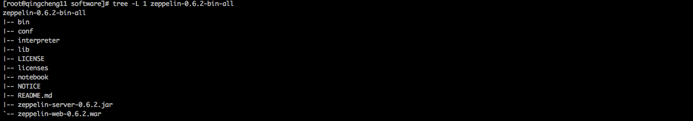
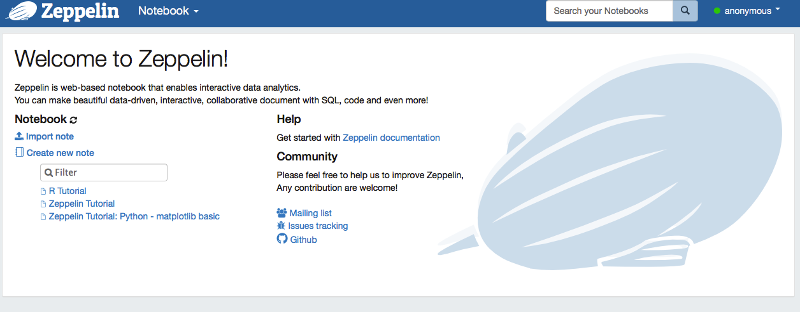

###1.下载并解压zepplin
1.官方网站
```
http://zeppelin.apache.org
```
2.github地址
```
https://github.com/apache/incubator-zeppelin
```
3.下载链接
```
http://mirrors.cnnic.cn/apache/zeppelin/zeppelin-0.6.2/zeppelin-0.6.2-bin-all.tgz
```
4.解压命令
```
tar -zxvf zeppelin-0.6.2-bin-all.tgz
```
5.查看命令
```
tree -L 1 
```
     
 
6.常用命令
```
1.启动zepplin
    $ZEPPLIN_HOME/bin/zeppelin-daemon.sh start
2.关闭zepplin
    $ZEPPLIN_HOMEbin/zeppelin-daemon.sh stop
3.重启zepplin
    $ZEPPELIN_HOME/bin/zeppelin-daemon.sh restart
```


###2.配置并分发环境变量
```
1.编辑环境变量文件
1.1执行命令：
    vim ~/.bashrc
1.2添加内容：
    export ZEPPELIN_HOME=/bigdata/software/zeppelin-0.6.2-bin-all
    export PATH=$ZEPPELIN_HOME/bin:$PATH
2.分发环境变量文件到其他机器
    scp ~/.bashrc  qingcheng12:~/.bashrc
    scp ~/.bashrc  qingcheng13:~/.bashrc
3.在每个机器上刷新环境变量
    source   ~/.bashrc
4.测试环境环境变量是否配置成功 
4.1执行命令：
    $ZEPPLIN_HOME
4.2执行效果：
    出现如下字样说明配置成功
    -bash: /bigdata/software/zeppelin-0.6.2-bin-all: Is a directory
```

###3.配置zeppelin
1.配置zeppelin-env.sh
```
1.从模板文件生成配置文件
cp $ZEPPLIN_HOME/conf/zeppelin-env.sh.template $ZEPPLIN_HOME/conf/zeppelin-env.sh

2.编辑配置文件
vim $ZEPPLIN_HOME/conf/zeppelin-env.sh

3.添加内容如下
export MASTER=spark://qingcheng11:7077,qingcheng12:7077
export HADOOP_CONF_DIR=$HADOOP_HOME/etc/hadoop
``` 


2.配置zeppelin-site.xml
```
1.从模板文件生成配置文件
cp $ZEPPLIN_HOME/conf/zeppelin-site.xml.template $ZEPPLIN_HOME/conf/zeppelin-site.xml

2.编辑配置文件
vim $ZEPPLIN_HOME/conf/zeppelin-site.xml

3.添加内容如下,防止与spark端口冲突
<property>
    <name>zeppelin.server.port</name>
    <value>8089</value>
    <description>Server port.</description>
</property>
``` 

###4.启动并验证zepplin
```
1.启动命令
$ZEPPLIN_HOME/bin/zeppelin-daemon.sh start

2.验证路径
http://qingcheng11:8089
```   
     
